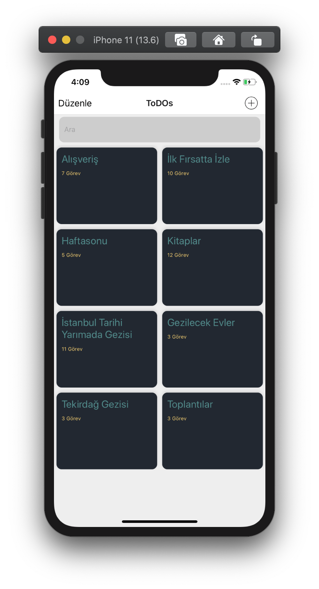
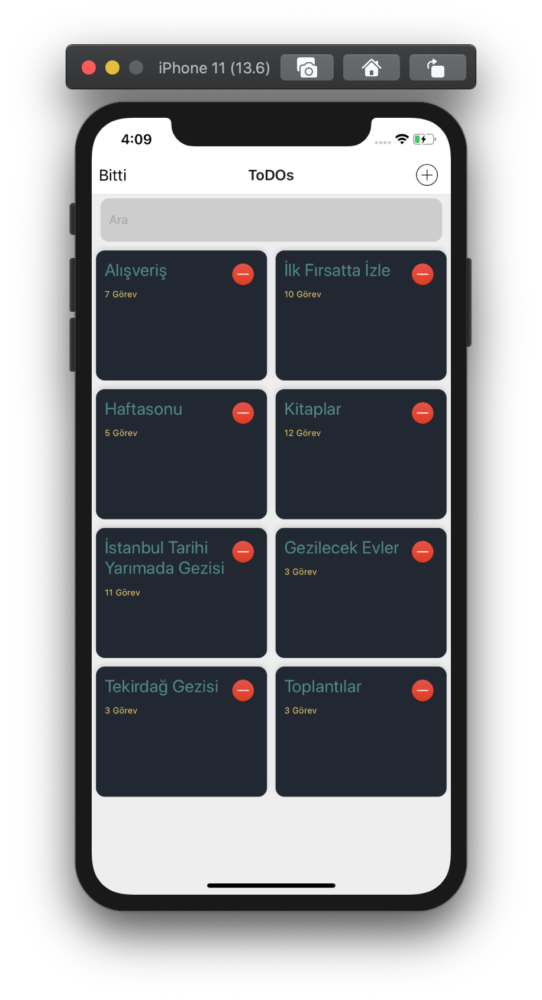
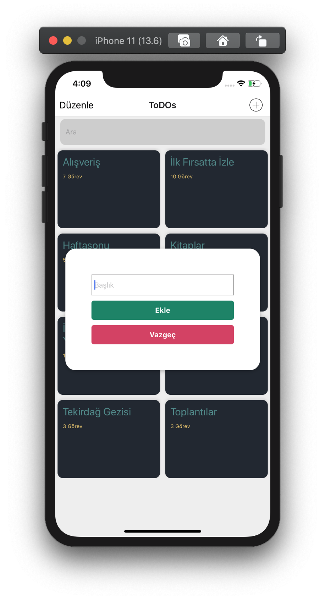
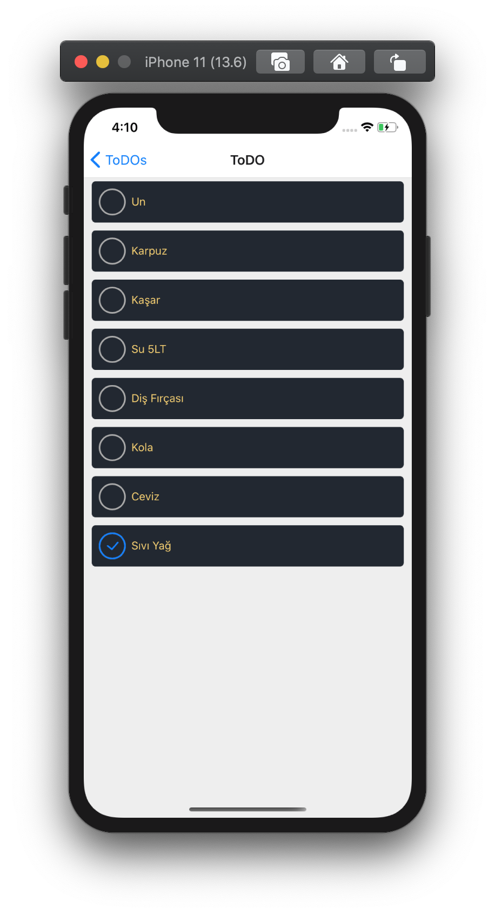
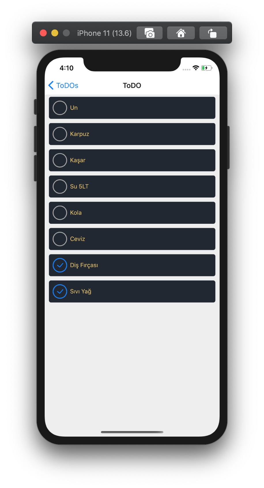
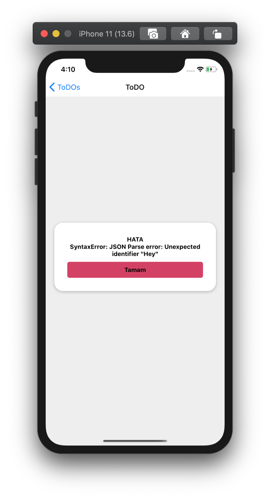

# ToDos (React Native)
1. React 16.13.1
     - useState
     - useEffect
2. React 16.13.1
     - View
     - FlatList
     - StyleSheet
     - TouchableHighlight
     - Image
     - Button
     - ActivityIndicator
     - Text
     - TextInput
3. react-native-community/checkbox [Checkbox](https://github.com/react-native-community/react-native-checkbox)
4. react-navigation/native [Navigation](https://reactnavigation.org/docs/getting-started)

# Ekran Görüntüleri
## Ana Ekran

## Detay

## Hata

